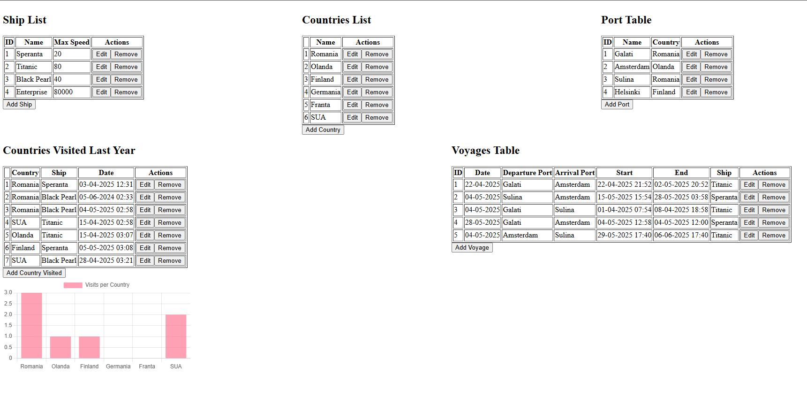

# Maritime Data Management App

This web application allows users to manage and visualize maritime-related data including ships, ports, countries, voyages, and country visits.

---

### Tech Stack

- **Backend:** ASP.NET Core (.NET 7), Entity Framework Core
- **Frontend:** Angular 17+ (Standalone Components)
- **Database:** SQL Server
- **Data Visualization:** Chart.js (via ng2-charts)

### Data Models
- **Ships:** name, maximum speed
- **Ports:** name, country
- **Countries:** name
- **Voyages:** ship, date, departure & arrival port, start & end times
- **Visited Countries:** country, ship, date of visitation

### Backend (ASP.NET Core)
- REST API for all entities
- CRUD operations supported
- Background cleanup: removes country visits older than 1 year (runs daily)

### Frontend (Angular)
- Displays and manages all tables
- Add, edit, remove data inline
- Responsive layout (tables aligned horizontally where appropriate)
- Live-updating **bar chart** of visits per country (last year only)

---

## App Usage

### Folder Structure:
```
/backend → ASP.NET Core API (DataContext, Models, Controllers)
/frontend → Angular app (Standalone components)
/README.md
```

### Clone Repository

### Run Backend

```
cd backend
dotnet restore
dotnet ef database update
dotnet run
```

### Run Frontend
```
cd frontend
npm install
ng serve
```
Angular app will run at: http://localhost:4200


---

### Demo Screenshot

